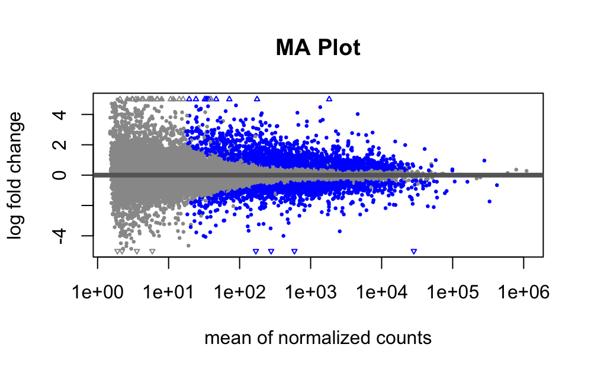

# 🧬 RNA-Seq Analysis: Lactation vs Pregnancy in Mouse Mammary Gland

This repository presents a complete RNA-Seq pipeline from raw data to functional interpretation, revealing key transcriptomic differences between pregnancy and lactation in *Mus musculus*.

## 🔬 Summary
- 6 SRA samples from GSE162396
- Single-end RNA-Seq
- Alignment with HISAT2
- Quantification with featureCounts
- DEGs identified using DESeq2
- Enrichment via GO & KEGG
- Visualizations with ggplot2, pheatmap, pathview

## 📊 Highlight Visuals
| MA Plot | Volcano Plot | PCA Plot |
|--------|---------------|----------|
|  |  |  |

| Heatmap of DEGs | Cell Cycle | Cytokine Pathway |
|-----------------|------------|------------------|
|  |  |  |

## 🧠 Key Findings
- Strong suppression of cell cycle in lactation
- Cytokine signaling pathways differ by condition
- Luminal vs basal expression shifts observed

## 📁 Repo Contents
- `/data`: FASTQ, BAM, counts
- `/results`: DESeq2 outputs, visualizations
- `/scripts`: full analysis pipeline (R and shell)
- `RNAseq_project_report.pdf`: full write-up

## 🧪 Reproducibility
Run scripts sequentially from `01_*.R` to `06_pathview.R`. Environment: R 4.3+, Bioconductor 3.18.

## 📄 License
MIT
